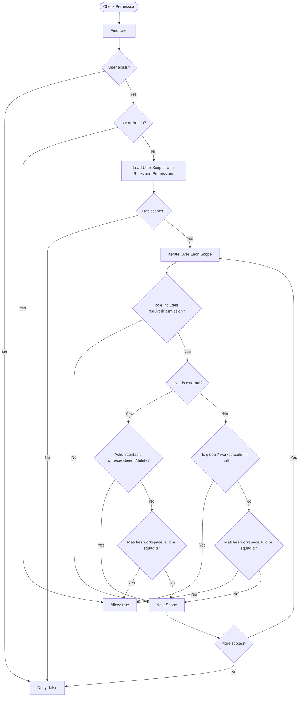

# Permissions System and Access Control Guide (Scoped RBAC)

This document details the architecture, technical operation, and frontend integration of the authorization and permissions system in **OpenRubberDocks**.

---

## 1. Overview and Architecture

The OpenRubberDocks authorization system implements a **Scoped RBAC (Role-Based Access Control with Contextual Scope)** model combined with a **User Type Hierarchy**.

Unlike a flat, traditional RBAC (where a user has a single role that applies system-wide), permissions in OpenRubberDocks can be assigned **globally** or **scoped to a specific resource** (such as a `Workspace` or, in future releases, a `Squad`).

```
                    ┌─────────────────────────┐
                    │          User           │
                    └────────────┬────────────┘
                                 │
                     Holds multiple assignments
                                 │
                    ┌────────────▼────────────┐
                    │      UserRoleScope      │
                    └─────┬─────────────┬─────┘
                          │             │
              Applies a   │             │  In the context of
                          ▼             ▼
                 ┌────────┴─────┐  ┌────┴────────────┐
                 │     Role     │  │      Scope      │
                 └────────┬─────┘  │  - Global (null)│
                          │        │  - Workspace    │
              Bundles     │        │  - (Squad)      │
                          ▼        └─────────────────┘
                 ┌────────┴──────────┐
                 │Permission (Action)│
                 │  e.g. 'item:write'│
                 └───────────────────┘
```

### Core Principles
1. **Defense in Depth**: The Frontend hides or disables UI controls to enhance user experience (UX), but the Backend **always** enforces access strictly via Guards and the Access Control Service.
2. **Deny by Default**: If a user does not explicitly hold a permission in the requested scope, access is denied with `403 Forbidden`.
3. **Engine-Level Mutation Lock for External Users**: Users classified as `external` can never execute mutating or destructive actions (`write`, `create`, `edit`, `delete`), even if a role with write permissions is inadvertently assigned to them.

---

## 2. User Types (`UserType`)

The platform classifies users into three hierarchical tiers defined in the `UserType` enum:

| User Type | Description | Restrictions and Business Rules |
| :--- | :--- | :--- |
| **`coreAdmin`** | Supreme platform super-administrator. | Total scope bypass. `hasPermission()` automatically returns `true` for any action. Their roles and scopes are immutable and cannot be altered via API. |
| **`internal`** | Regular employees and internal organization members. | Can have global permissions (`workspaceId: null`) or workspace-scoped permissions. Can perform read and write operations based on role permissions. |
| **`external`** | Invited clients, contractors, or guest auditors. | **Strictly read-only**. The authorization engine automatically blocks any permission containing `write`, `create`, `edit`, or `delete`. **Must always** have a specific scope (`workspaceUuid`); cannot hold global assignments. |

---

## 3. Data Model and Entities (Backend)

The module is located in `backend/src/modules/authorization/` and consists of four main entities:

### A. `Permission` Entity (`permissions`)
Represents an atomic action or capability within the system.
- `uuid`: Unique public identifier (UUIDv4).
- `action`: Unique string in `resource:action` format (e.g., `workspace:read`, `workspace:write`, `document:create`, `role:assign`).

Pre-configured base permissions in the system:
```typescript
export const BASE_PERMISSIONS = [
  { action: 'workspace:read' },
  { action: 'workspace:write' },
  { action: 'document:read' },
  { action: 'document:write' },
  { action: 'role:create' },
  { action: 'role:assign' },
  { action: 'global:audit' },
];
```

### B. `Role` Entity (`roles`)
Represents a collection of permissions grouped under a descriptive name.
- `uuid`: Unique public identifier.
- `name`: Role name (e.g., `'Super Admin'`, `'External Reader'`, `'Workspace Manager'`).
- `description`: Explanation of the role's purpose.
- `isSystemDefined`: Boolean flag. If `true`, the role is system-provided and **cannot be modified or deleted** via API.
- `permissions`: `ManyToMany` relationship with `Permission` via the `role_permissions` join table.

### C. `UserRoleScope` Entity (`user_role_scopes`)
Binds a user to a role within a specific context.
- `user`: `ManyToOne` relationship with `User` (`user_id`).
- `role`: `ManyToOne` relationship with `Role` (`role_id`).
- `workspace`: `ManyToOne` relationship with `Workspace` (`workspace_id`, nullable). If `null`, the role has **global** scope (only permitted for internal users).
- `squadId`: Nullable column reserved for team/squad scoping.

---

## 4. Permission Evaluation Engine (`AccessControlService`)

The central service that evaluates whether a user can perform an action is `AccessControlService.hasPermission()`:

```typescript
// backend/src/modules/authorization/services/access-control.service.ts
async hasPermission(
  userId: number, 
  requiredPermission: string, 
  workspaceUuid?: string, 
  squadId?: number
): Promise<boolean>
```

### Decision Flow:


---

## 5. Backend Endpoint Enforcement (Guards and Decorators)

To protect an endpoint in NestJS, two decorators and the permissions guard work in tandem:

1. `@RequirePermissions(...permissions: string[])`: Declares the required permission actions.
2. `@CheckScope(paramName: string)`: Specifies which route parameter (e.g., `'uuid'`) contains the target `Workspace` identifier to evaluate.
3. `@UseGuards(AuthGuard('jwt'), PermissionsGuard)`: Validates the session and verifies permissions within the matching scope.

### Controller Example:
```typescript
// backend/src/modules/workspace/controllers/workspace.controller.ts
@UseGuards(AuthGuard('jwt'), PermissionsGuard)
@Controller('workspaces')
export class WorkspaceController {
  
  // Requires global or scoped read permission to list workspaces
  @Get()
  @RequirePermissions('workspace:read')
  findAll(@JsonApiQuery() query: JsonApiQueryOptions) {
    return this.workspaceService.findAll(query);
  }

  // Verifies that the user has 'workspace:read' SPECIFICALLY in workspace ':uuid'
  @Get(':uuid')
  @RequirePermissions('workspace:read')
  @CheckScope('uuid')
  findOne(@Param('uuid') uuid: string) {
    return this.workspaceService.findOne(uuid);
  }

  // Verifies that the user has 'workspace:write' SPECIFICALLY in workspace ':uuid'
  @Patch(':uuid')
  @RequirePermissions('workspace:write')
  @CheckScope('uuid')
  update(@Param('uuid') uuid: string, @JsonApiBody() dto: UpdateWorkspaceDto) {
    return this.workspaceService.update(uuid, dto);
  }
}
```

If the user lacks the permission or the scope does not match, `PermissionsGuard` throws:
```json
{
  "statusCode": 403,
  "message": "Missing permission: workspace:write in the current scope",
  "error": "Forbidden"
}
```

---

## 6. Frontend Integration (React + TypeScript)

Following the frontend architecture guidelines (`frontend/docs/ARCHITECTURE.md`), integration is organized across global state (`@global` / `features/auth`), utility hooks, and declarative UI components.

### A. Domain Types in Frontend

```typescript
// src/features/auth/types/authorization.types.ts
export type UserType = 'coreAdmin' | 'internal' | 'external';

export interface Permission {
  uuid: string;
  action: string;
}

export interface Role {
  uuid: string;
  name: string;
  description?: string;
  isSystemDefined: boolean;
  permissions: Permission[];
}

export interface UserRoleScope {
  uuid: string;
  role: Role;
  workspace?: {
    uuid: string;
    name?: string;
  } | null;
  squadId?: number | null;
}

export interface CurrentUser {
  uuid: string;
  username: string;
  rubberHandle: string;
  type: UserType;
  scopes: UserRoleScope[];
}
```

### B. Permissions Hook (`usePermissions`)

This hook reactively mirrors the backend `AccessControlService` logic on the client for synchronous UI evaluations:

```typescript
// src/core/global/hooks/usePermissions.ts
import { useCallback } from 'react';
import { useAuth } from '@features/auth/hooks/useAuth';

export const usePermissions = () => {
  const { user } = useAuth();

  /**
   * Evaluates if the current user possesses a permission in a given context
   */
  const hasPermission = useCallback((action: string, workspaceUuid?: string): boolean => {
    if (!user) return false;

    // Rule 1: coreAdmin has full access regardless of scope
    if (user.type === 'coreAdmin') {
      return true;
    }

    if (!user.scopes || user.scopes.length === 0) {
      return false;
    }

    for (const scope of user.scopes) {
      const hasAction = scope.role.permissions.some(p => p.action === action);

      if (hasAction) {
        // Rule 2: External users cannot mutate data under any circumstance
        if (user.type === 'external') {
          const isMutation = ['write', 'create', 'edit', 'delete'].some(verb => action.includes(verb));
          if (isMutation) continue;

          if (workspaceUuid && scope.workspace?.uuid === workspaceUuid) {
            return true;
          }
          continue;
        }

        // Rule 3: Internal user with global scope (workspace is null)
        if (!scope.workspace) {
          return true;
        }

        // Rule 4: Internal user with specific workspace scope
        if (workspaceUuid && scope.workspace?.uuid === workspaceUuid) {
          return true;
        }
      }
    }

    return false;
  }, [user]);

  const hasAnyPermission = useCallback((actions: string[], workspaceUuid?: string): boolean => {
    return actions.some(action => hasPermission(action, workspaceUuid));
  }, [hasPermission]);

  const isCoreAdmin = user?.type === 'coreAdmin';

  return {
    hasPermission,
    hasAnyPermission,
    isCoreAdmin,
    userType: user?.type,
  };
};
```

### C. Declarative UI Component (`<Can />`)

Conditionally renders JSX elements cleanly and semantically:

```tsx
// src/core/components/ui/Can.tsx
import React from 'react';
import { usePermissions } from '@global-hooks/usePermissions';

interface CanProps {
  action: string;
  scope?: string; // workspaceUuid
  children: React.ReactNode;
  fallback?: React.ReactNode;
}

export const Can: React.FC<CanProps> = ({ action, scope, children, fallback = null }) => {
  const { hasPermission } = usePermissions();

  const allowed = hasPermission(action, scope);

  if (!allowed) {
    return <>{fallback}</>;
  }

  return <>{children}</>;
};
```

### D. Route Protection with React Router (`ScopedRouteGuard`)

```tsx
// src/core/routes/guards/ScopedRouteGuard.tsx
import React from 'react';
import { Navigate, useParams } from 'react-router-dom';
import { usePermissions } from '@global-hooks/usePermissions';

interface ScopedRouteGuardProps {
  requiredPermission: string;
  children: React.ReactElement;
  redirectTo?: string;
}

export const ScopedRouteGuard: React.FC<ScopedRouteGuardProps> = ({
  requiredPermission,
  children,
  redirectTo = '/unauthorized',
}) => {
  const { workspaceUuid } = useParams<{ workspaceUuid: string }>();
  const { hasPermission } = usePermissions();

  const isAuthorized = hasPermission(requiredPermission, workspaceUuid);

  if (!isAuthorized) {
    return <Navigate to={redirectTo} replace />;
  }

  return children;
};
```

---

## 7. Practical Use Cases

Here are the most common scenarios across the platform:

### Case 1: Platform Super-Administrator (`coreAdmin`)
* **Context**: A principal developer or DevOps engineer logs in with `coreAdmin` credentials.
* **Backend Behavior**:
  - `AccessControlService.hasPermission()` detects `user.type === UserType.COREADMIN` and immediately returns `true` without querying scope tables.
  - The scope assignment API (`POST /authorization/scopes`) rejects any attempt to add or remove scopes for this user (`CANNOT_MODIFY_CORE_USER`).
* **Frontend Behavior**:
  - `usePermissions().isCoreAdmin` is `true`.
  - The `<Can>` component renders all global administrative sections (role management, audit logs, system configuration).

### Case 2: Global Organization Administrator (Internal User)
* **Context**: A Chief Technology Officer (CTO) or internal operations lead.
* **Database Assignment**:
  ```json
  {
    "userUuid": "user-internal-01",
    "roleUuid": "role-super-admin-uuid",
    "workspaceUuid": null
  }
  ```
* **Behavior**:
  - With `workspace: null`, the role applies platform-wide.
  - Can list all workspaces, create new workspaces, and manage custom roles.
  - In the frontend, the workspace switcher allows viewing and managing any workspace with admin privileges.

### Case 3: User with Contextual Workspace Permissions (Multi-Tenancy)
* **Context**: An engineer (Mary) participates in two distinct projects:
  - In the **"Billing" Workspace**, she is an **Editor** (`workspace:write`, `document:write`).
  - In the **"Security" Workspace**, she is strictly a **Viewer** (`workspace:read`, `document:read`).
* **Frontend Usage**:
  ```tsx
  // Component within the workspace dashboard
  const WorkspaceDashboard = ({ workspaceUuid }: { workspaceUuid: string }) => {
    return (
      <div>
        <h1>Project Dashboard</h1>

        {/* Only visible in workspaces where the user holds edit permissions */}
        <Can action="workspace:write" scope={workspaceUuid}>
          <button onClick={handleOpenSettingsModal}>
            Workspace Settings
          </button>
        </Can>

        <Can 
          action="document:write" 
          scope={workspaceUuid}
          fallback={<p className="text-muted">Read-only mode active.</p>}
        >
          <button onClick={handleCreateDocument}>+ Create Document</button>
        </Can>
      </div>
    );
  };
  ```
* **Outcome**:
  - In the "Billing" Workspace, buttons are visible and interactive.
  - When switching to the "Security" Workspace, the UI automatically displays the *"Read-only mode active"* message and hides mutation buttons.

### Case 4: External Guest or Auditor (`external`)
* **Context**: An external compliance auditor is invited to inspect deliverables in a specific workspace.
* **Backend Protection**:
  - Even if an administrator accidentally assigns a role containing `document:write` or `workspace:delete`:
    ```typescript
    if (user.type === UserType.EXTERNAL) {
      if (requiredPermission.includes('write') || requiredPermission.includes('delete')) {
        continue; // Enforced bypass of mutation permissions
      }
    }
    ```
  - Any mutating API request returns `403 Forbidden`.
* **Frontend**:
  - Mutation forms render in read-only mode (`disabled`).
  - Destructive buttons are omitted from the DOM.

### Case 5: Dynamic Role Creation and Scope Assignment (Admin Panel)
* **Context**: An administrator creates a custom role for Tech Leads and assigns it to an employee in a specific workspace.
* **HTTP Flow**:

1. **Role Creation**:
   ```bash
   POST /authorization/roles
   Content-Type: application/vnd.api+json

   {
     "data": {
       "attributes": {
         "name": "Tech Lead",
         "description": "Can manage documents and view workspace configuration",
         "permissionUuids": [
           "d3b07384-d113-40e1-965a-0639f75f7823", // document:write
           "e4c18495-e224-41f2-a76b-1740a86a8934"  // workspace:read
         ]
       }
     }
   }
   ```

2. **Scope Assignment**:
   ```bash
   POST /authorization/scopes
   Content-Type: application/vnd.api+json

   {
     "data": {
       "attributes": {
         "userUuid": "7a8b9c0d-1111-2222-3333-444455556666",
         "roleUuid": "<tech-lead-role-uuid>",
         "workspaceUuid": "9f8e7d6c-5555-4444-3333-222211110000"
       }
     }
   }
   ```

---

## 8. Authorization Error Handling (`403 Forbidden`)

In the frontend, `@http-error` (`parseHttpError`) intercepts backend errors. When an unauthorized action is attempted, the response is parsed into a standardized `AppError`:

```typescript
// Handling in a service or TanStack Query mutation
import { parseHttpError } from '@http-error/http-error.handler';
import { HTTP_STATUS } from '@http-constants/http-status.constants';

try {
  await updateWorkspaceService(workspaceUuid, payload);
} catch (error) {
  const appError = await parseHttpError(error);
  
  if (appError.status === HTTP_STATUS.FORBIDDEN) {
    toast.error('You do not have the required permissions to modify this workspace.');
  }
}
```

---

## 9. Best Practices Summary

1. **Never trust the client alone**: Frontend checks (`<Can>`, `disabled`) are strictly for UX. Security is 100% enforced by Backend Guards (`PermissionsGuard` + `AccessControlService`).
2. **Always pair scoped endpoints with `@CheckScope`**: When a route param identifies a workspace, decorate the controller method with `@CheckScope('paramName')` to ensure contextual validation.
3. **Protect system-defined roles**: Do not attempt to update or delete roles marked with `isSystemDefined: true` (`Super Admin`, `External Reader`). Doing so yields `CANNOT_MODIFY_SYSTEM_ROLE`.
4. **Maintain external user boundaries**: Remember that `external` accounts cannot execute write operations; if a collaborator requires edit capabilities, they must be provisioned as `internal`.
