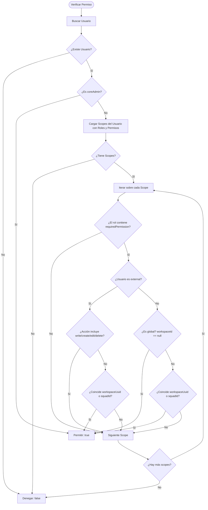

# Guía del Sistema de Permisos y Control de Acceso (RBAC Scoped)

Este documento detalla la arquitectura, funcionamiento técnico e integración frontend del sistema de autorización y permisos de **OpenRubberDocks**.

---

## 1. Visión General y Arquitectura

El sistema de autorización de OpenRubberDocks implementa un modelo **RBAC Scoped (Role-Based Access Control con Alcance Contextual)** combinado con una **Jerarquía de Tipos de Usuario**. 

A diferencia de un RBAC tradicional plano (donde un usuario tiene un rol que aplica a toda la aplicación), en OpenRubberDocks los permisos pueden asignarse de manera **global** o estar **acotados a un recurso específico** (por ejemplo, un `Workspace` o en el futuro un `Squad`).

```
                    ┌─────────────────────────┐
                    │      Usuario (User)     │
                    └────────────┬────────────┘
                                 │
                     Posee múltiples asignaciones
                                 │
                    ┌────────────▼────────────┐
                    │     UserRoleScope       │
                    └─────┬─────────────┬─────┘
                          │             │
              Aplica un   │             │  En el contexto de
                          ▼             ▼
                 ┌────────┴─────┐  ┌────┴────────────┐
                 │  Rol (Role)  │  │ Alcance (Scope) │
                 └────────┬─────┘  │  - Global (null)│
                          │        │  - Workspace    │
              Agrupa varios        │  - (Squad)      │
                          ▼        └─────────────────┘
                 ┌────────┴──────────┐
                 │ Permiso (Action)  │
                 │  ej. 'item:write' │
                 └───────────────────┘
```

### Principios Fundamentales
1. **Defensa en Profundidad**: El Frontend oculta o deshabilita controles para mejorar la experiencia de usuario (UX), pero el Backend **siempre** valida de forma estricta mediante Guards y Servicios de Acceso.
2. **Denegación por Defecto (Deny by Default)**: Si un usuario no posee explícitamente un permiso en el alcance requerido, la acción es denegada con `403 Forbidden`.
3. **Restricción de Usuarios Externos a Nivel de Motor**: Los usuarios clasificados como externos jamás pueden ejecutar acciones destructivas o de mutación (`write`, `create`, `edit`, `delete`), incluso si accidentalmente se les asignara un rol que las contenga.

---

## 2. Tipos de Usuario (`UserType`)

El sistema clasifica a los usuarios en tres niveles jerárquicos definidos en `UserType`:

| Tipo de Usuario | Descripción | Restricciones y Reglas de Negocio |
| :--- | :--- | :--- |
| **`coreAdmin`** | Superadministrador supremo del sistema. | Bypass total de scopes. `hasPermission()` retorna `true` automáticamente para cualquier acción. Sus roles y alcances son inmutables y no se pueden alterar vía API. |
| **`internal`** | Empleados y colaboradores internos. | Puede tener permisos globales (`workspaceId: null`) o permisos acotados a workspaces particulares. Puede realizar lecturas y escrituras según los permisos de sus roles. |
| **`external`** | Clientes, contratistas o auditores invitados. | **Estrictamente de solo lectura**. El motor bloquea automáticamente cualquier permiso que contenga `write`, `create`, `edit` o `delete`. **Siempre** debe tener un alcance específico (`workspaceUuid`); no puede tener asignaciones globales. |

---

## 3. Modelo de Datos y Entidades (Backend)

El módulo reside en `backend/src/modules/authorization/` y se compone de cuatro entidades principales:

### A. Entidad `Permission` (`permissions`)
Representa una capacidad o acción atómica dentro del sistema.
- `uuid`: Identificador público único (UUIDv4).
- `action`: Cadena única en formato `recurso:accion` (ej. `workspace:read`, `workspace:write`, `document:create`, `role:assign`).

Permisos base preconfigurados en el sistema:
```typescript
export const BASE_PERMISSIONS = [
  { action: 'workspace:read' },
  { action: 'workspace:write' },
  { action: 'document:read' },
  { action: 'document:write' },
  { action: 'role:create' },
  { action: 'role:assign' },
  { action: 'global:audit' },
];
```

### B. Entidad `Role` (`roles`)
Representa un conjunto de permisos agrupados bajo un nombre descriptivo.
- `uuid`: Identificador público único.
- `name`: Nombre del rol (ej. `'Super Admin'`, `'External Reader'`, `'Workspace Manager'`).
- `description`: Explicación del propósito del rol.
- `isSystemDefined`: Booleano. Si es `true`, el rol fue creado por el sistema y **no puede ser modificado ni eliminado** vía API.
- `permissions`: Relación `ManyToMany` con `Permission` mediante la tabla pivote `role_permissions`.

### C. Entidad `UserRoleScope` (`user_role_scopes`)
Vincula a un usuario con un rol dentro de un contexto determinado.
- `user`: Relación `ManyToOne` con `User` (`user_id`).
- `role`: Relación `ManyToOne` con `Role` (`role_id`).
- `workspace`: Relación `ManyToOne` con `Workspace` (`workspace_id`, nullable). Si es `null`, el rol es de alcance **global** (solo permitido para usuarios internos).
- `squadId`: Campo nullable reservado para alcances de equipo/squad.

---

## 4. Motor de Evaluación de Permisos (`AccessControlService`)

El servicio central que valida si un usuario puede ejecutar una acción es `AccessControlService.hasPermission()`:

```typescript
// backend/src/modules/authorization/services/access-control.service.ts
async hasPermission(
  userId: number, 
  requiredPermission: string, 
  workspaceUuid?: string, 
  squadId?: number
): Promise<boolean>
```

### Flujo de Decisión:


---

## 5. Aplicación en Endpoints del Backend (Guards y Decoradores)

Para proteger un endpoint en NestJS, se combinan dos decoradores y el guard de permisos:

1. `@RequirePermissions(...permissions: string[])`: Define la lista de acciones requeridas.
2. `@CheckScope(paramName: string)`: Indica qué parámetro de la URL (ej. `'uuid'`) contiene el identificador del Workspace a evaluar.
3. `@UseGuards(AuthGuard('jwt'), PermissionsGuard)`: Valida la sesión y ejecuta la verificación de permisos en el alcance correspondiente.

### Ejemplo en un Controlador:
```typescript
// backend/src/modules/workspace/controllers/workspace.controller.ts
@UseGuards(AuthGuard('jwt'), PermissionsGuard)
@Controller('workspaces')
export class WorkspaceController {
  
  // Requiere permiso global o en contexto para ver workspaces
  @Get()
  @RequirePermissions('workspace:read')
  findAll(@JsonApiQuery() query: JsonApiQueryOptions) {
    return this.workspaceService.findAll(query);
  }

  // Verifica que el usuario tenga 'workspace:read' ESPECÍFICAMENTE en el workspace ':uuid'
  @Get(':uuid')
  @RequirePermissions('workspace:read')
  @CheckScope('uuid')
  findOne(@Param('uuid') uuid: string) {
    return this.workspaceService.findOne(uuid);
  }

  // Verifica que el usuario tenga 'workspace:write' ESPECÍFICAMENTE en el workspace ':uuid'
  @Patch(':uuid')
  @RequirePermissions('workspace:write')
  @CheckScope('uuid')
  update(@Param('uuid') uuid: string, @JsonApiBody() dto: UpdateWorkspaceDto) {
    return this.workspaceService.update(uuid, dto);
  }
}
```

Si el usuario no cuenta con el permiso o el alcance no coincide, el `PermissionsGuard` lanza:
```json
{
  "statusCode": 403,
  "message": "Missing permission: workspace:write in the current scope",
  "error": "Forbidden"
}
```

---

## 6. Integración con el Frontend (React + TypeScript)

Siguiendo las directrices de arquitectura de frontend (`frontend/docs/ARCHITECTURE.md`), la integración se divide entre el estado global (`@global` / `features/auth`), utilidades y componentes declarativos de autorización.

### A. Tipos de Dominio en Frontend

```typescript
// src/features/auth/types/authorization.types.ts
export type UserType = 'coreAdmin' | 'internal' | 'external';

export interface Permission {
  uuid: string;
  action: string;
}

export interface Role {
  uuid: string;
  name: string;
  description?: string;
  isSystemDefined: boolean;
  permissions: Permission[];
}

export interface UserRoleScope {
  uuid: string;
  role: Role;
  workspace?: {
    uuid: string;
    name?: string;
  } | null;
  squadId?: number | null;
}

export interface CurrentUser {
  uuid: string;
  username: string;
  rubberHandle: string;
  type: UserType;
  scopes: UserRoleScope[];
}
```

### B. Hook de Permisos (`usePermissions`)

Este hook replica de forma reactiva la lógica de `AccessControlService` en el cliente para evaluaciones síncronas de UI:

```typescript
// src/core/global/hooks/usePermissions.ts
import { useCallback } from 'react';
import { useAuth } from '@features/auth/hooks/useAuth';

export const usePermissions = () => {
  const { user } = useAuth();

  /**
   * Evalúa si el usuario actual posee un permiso en un contexto dado
   */
  const hasPermission = useCallback((action: string, workspaceUuid?: string): boolean => {
    if (!user) return false;

    // Regla 1: coreAdmin tiene acceso total sin importar el scope
    if (user.type === 'coreAdmin') {
      return true;
    }

    if (!user.scopes || user.scopes.length === 0) {
      return false;
    }

    for (const scope of user.scopes) {
      const hasAction = scope.role.permissions.some(p => p.action === action);

      if (hasAction) {
        // Regla 2: Usuario Externo no puede escribir bajo ninguna circunstancia
        if (user.type === 'external') {
          const isMutation = ['write', 'create', 'edit', 'delete'].some(verb => action.includes(verb));
          if (isMutation) continue;

          if (workspaceUuid && scope.workspace?.uuid === workspaceUuid) {
            return true;
          }
          continue;
        }

        // Regla 3: Usuario Interno con alcance global (workspace null)
        if (!scope.workspace) {
          return true;
        }

        // Regla 4: Usuario Interno con alcance específico por workspace
        if (workspaceUuid && scope.workspace?.uuid === workspaceUuid) {
          return true;
        }
      }
    }

    return false;
  }, [user]);

  const hasAnyPermission = useCallback((actions: string[], workspaceUuid?: string): boolean => {
    return actions.some(action => hasPermission(action, workspaceUuid));
  }, [hasPermission]);

  const isCoreAdmin = user?.type === 'coreAdmin';

  return {
    hasPermission,
    hasAnyPermission,
    isCoreAdmin,
    userType: user?.type,
  };
};
```

### C. Componente Declarativo `<Can />`

Permite condicionar bloques de JSX de forma semántica y limpia:

```tsx
// src/core/components/ui/Can.tsx
import React from 'react';
import { usePermissions } from '@global-hooks/usePermissions';

interface CanProps {
  action: string;
  scope?: string; // workspaceUuid
  children: React.ReactNode;
  fallback?: React.ReactNode;
}

export const Can: React.FC<CanProps> = ({ action, scope, children, fallback = null }) => {
  const { hasPermission } = usePermissions();

  const allowed = hasPermission(action, scope);

  if (!allowed) {
    return <>{fallback}</>;
  }

  return <>{children}</>;
};
```

### D. Protección de Rutas con React Router (`ScopedRouteGuard`)

```tsx
// src/core/routes/guards/ScopedRouteGuard.tsx
import React from 'react';
import { Navigate, useParams } from 'react-router-dom';
import { usePermissions } from '@global-hooks/usePermissions';

interface ScopedRouteGuardProps {
  requiredPermission: string;
  children: React.ReactElement;
  redirectTo?: string;
}

export const ScopedRouteGuard: React.FC<ScopedRouteGuardProps> = ({
  requiredPermission,
  children,
  redirectTo = '/unauthorized',
}) => {
  const { workspaceUuid } = useParams<{ workspaceUuid: string }>();
  const { hasPermission } = usePermissions();

  const isAuthorized = hasPermission(requiredPermission, workspaceUuid);

  if (!isAuthorized) {
    return <Navigate to={redirectTo} replace />;
  }

  return children;
};
```

---

## 7. Casos de Uso Prácticos

A continuación se presentan los escenarios más habituales dentro de la plataforma:

### Caso 1: Superadministrador del Sistema (`coreAdmin`)
* **Contexto**: Un desarrollador o devops principal accede con credenciales de usuario `coreAdmin`.
* **Comportamiento en Backend**:
  - `AccessControlService.hasPermission()` detecta `user.type === UserType.COREADMIN` y retorna `true` de inmediato sin consultar tablas de scopes.
  - La API de asignación (`POST /authorization/scopes`) rechaza cualquier intento de agregar o quitar scopes a este usuario (`CANNOT_MODIFY_CORE_USER`).
* **Comportamiento en Frontend**:
  - `usePermissions().isCoreAdmin` es `true`.
  - El componente `<Can>` renderiza todas las secciones administrativas globales (gestión de roles, logs de auditoría, configuración del servidor).

### Caso 2: Administrador Global de la Organización (Usuario Interno)
* **Contexto**: Un director de tecnología (CTO) o jefe de equipo interno.
* **Asignación en Base de Datos**:
  ```json
  {
    "userUuid": "user-internal-01",
    "roleUuid": "role-super-admin-uuid",
    "workspaceUuid": null
  }
  ```
* **Comportamiento**:
  - Al tener `workspace: null`, su rol aplica a toda la plataforma.
  - Puede listar todos los workspaces, crear nuevos workspaces y gestionar roles.
  - En el frontend, el selector de workspaces le permite ver y entrar a cualquiera con permisos de administrador.

### Caso 3: Usuario con Permisos Diferenciados por Workspace (Multi-tenancy)
* **Contexto**: Una ingeniera (María) participa en dos proyectos:
  - En **Workspace "Finanzas"** es **Editora** (`workspace:write`, `document:write`).
  - En **Workspace "Infraestructura"** es únicamente **Lectora** (`workspace:read`, `document:read`).
* **Uso en Frontend**:
  ```tsx
  // Componente dentro del dashboard del workspace
  const WorkspaceDashboard = ({ workspaceUuid }: { workspaceUuid: string }) => {
    return (
      <div>
        <h1>Detalles del Proyecto</h1>

        {/* Solo visible en el workspace donde tiene permiso de edición */}
        <Can action="workspace:write" scope={workspaceUuid}>
          <button onClick={handleOpenSettingsModal}>
            Configuración del Workspace
          </button>
        </Can>

        <Can 
          action="document:write" 
          scope={workspaceUuid}
          fallback={<p className="text-muted">Modo de solo lectura activado.</p>}
        >
          <button onClick={handleCreateDocument}>+ Crear Documento</button>
        </Can>
      </div>
    );
  };
  ```
* **Resultado**:
  - Cuando María abre el Workspace "Finanzas", los botones están disponibles y funcionales.
  - Cuando cambia al Workspace "Infraestructura", la UI muestra automáticamente el aviso *"Modo de solo lectura activado"* y oculta los botones de mutación.

### Caso 4: Invitado Externo o Auditor (`external`)
* **Contexto**: Se invita a un auditor externo o cliente a revisar un Workspace de entregables.
* **Blindaje en Backend**:
  - Incluso si un administrador le asignara por error un rol con permisos como `document:write` o `workspace:delete`:
    ```typescript
    if (user.type === UserType.EXTERNAL) {
      if (requiredPermission.includes('write') || requiredPermission.includes('delete')) {
        continue; // Ignorado forzosamente
      }
    }
    ```
  - Toda llamada a endpoints de mutación responderá `403 Forbidden`.
* **Frontend**:
  - Los formularios de edición se renderizan en modo solo lectura (`disabled`).
  - Las acciones destructivas ni siquiera aparecen en el DOM.

### Caso 5: Creación de Roles Dinámicos y Asignación de Alcances (Panel de Administración)
* **Contexto**: Un administrador necesita crear un rol personalizado para líderes técnicos y asignarlo a un usuario en un workspace específico.
* **Flujo de Peticiones HTTP**:

1. **Creación del Rol**:
   ```bash
   POST /authorization/roles
   Content-Type: application/vnd.api+json

   {
     "data": {
       "attributes": {
         "name": "Tech Lead",
         "description": "Puede gestionar documentos y leer configuración del workspace",
         "permissionUuids": [
           "d3b07384-d113-40e1-965a-0639f75f7823", // document:write
           "e4c18495-e224-41f2-a76b-1740a86a8934"  // workspace:read
         ]
       }
     }
   }
   ```

2. **Asignación del Alcance**:
   ```bash
   POST /authorization/scopes
   Content-Type: application/vnd.api+json

   {
     "data": {
       "attributes": {
         "userUuid": "7a8b9c0d-1111-2222-3333-444455556666",
         "roleUuid": "<uuid-del-nuevo-rol-tech-lead>",
         "workspaceUuid": "9f8e7d6c-5555-4444-3333-222211110000"
       }
     }
   }
   ```

---

## 8. Manejo de Errores de Autorización (`403 Forbidden`)

En el frontend, el módulo `@http-error` (`parseHttpError`) intercepta los errores del backend. Cuando un usuario intenta realizar una operación no permitida, el error es capturado y tipado como `AppError`:

```typescript
// Ejemplo de manejo en un servicio o mutación de TanStack Query
import { parseHttpError } from '@http-error/http-error.handler';
import { HTTP_STATUS } from '@http-constants/http-status.constants';

try {
  await updateWorkspaceService(workspaceUuid, payload);
} catch (error) {
  const appError = await parseHttpError(error);
  
  if (appError.status === HTTP_STATUS.FORBIDDEN) {
    // Notificación clara para el usuario
    toast.error('No tienes los permisos necesarios para realizar esta modificación en este workspace.');
  }
}
```

---

## 9. Resumen de Buenas Prácticas

1. **Nunca confiar en el cliente**: Las validaciones de UI con `<Can>` o `disabled` son estrictamente para mejorar la UX. La seguridad reside 100% en los Guards del Backend (`PermissionsGuard` + `AccessControlService`).
2. **Usar `@CheckScope` siempre que un recurso pertenezca a un Workspace**: Si una ruta recibe un `:uuid` de un workspace, acompáñala siempre de `@CheckScope('uuid')` para que el guard valide el contexto exacto.
3. **Roles del sistema inmutables**: No intentes editar ni borrar roles marcados con `isSystemDefined: true` (`Super Admin`, `External Reader`). Modificarlos provocará un error `CANNOT_MODIFY_SYSTEM_ROLE`.
4. **Respetar el aislamiento de usuarios externos**: Recuerda que los usuarios `external` nunca podrán modificar datos; si un cliente necesita capacidades de edición, su cuenta debe ser creada como tipo `internal`.
